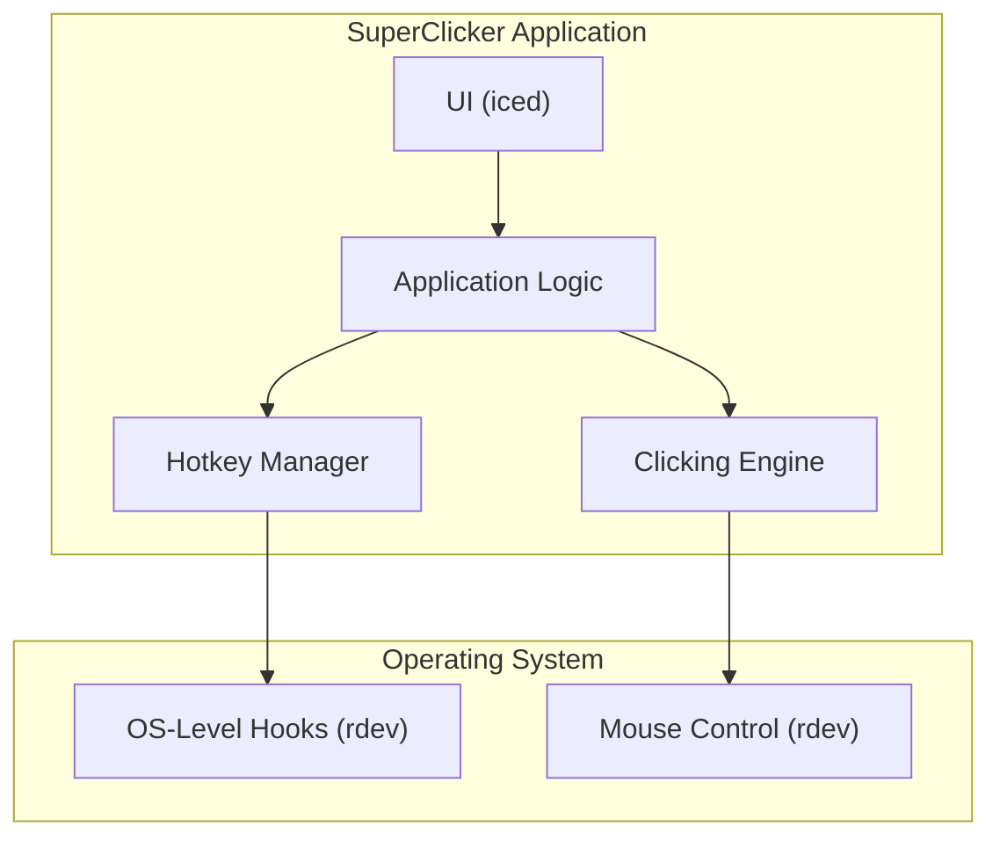

# SuperClicker Architecture Document

## 1. Introduction

This document outlines the software architecture for the SuperClicker application. It is a native Windows desktop application designed to be lightweight and efficient.

This is a greenfield project, and no existing starter template will be used.

### Change Log

| Date       | Version | Description   | Author  |
| :--------- | :------ | :------------ | :------ |
| 2025-10-29 | 1.0     | Initial Draft | Winston |

## 2. High-Level Architecture

- **Architectural Style:** Monolithic Desktop Application. A single, self-contained executable will contain all the application's logic.
- **Repository Structure:** Monorepo.

### High-Level Project Diagram



### Architectural and Design Patterns

- **The Elm Architecture (as implemented by `iced`):** This pattern separates the application into `Model` (the state), `View` (the UI), and `Update` (the logic that updates the state based on messages). This is the standard pattern for `iced` applications and promotes a clear data flow.
- **Singleton-like Global State:** Core components like the `HotkeyManager` and `ClickingEngine` will be managed as part of the global application state within the `iced` framework to ensure a single source of truth.

## 3. Tech Stack

| Category      | Technology | Version | Purpose                               | Rationale                                                                                                |
| :------------ | :--------- | :------ | :------------------------------------ | :------------------------------------------------------------------------------------------------------- |
| Language      | Rust       | latest  | Primary development language          | Provides high performance, memory safety, and creates small, dependency-free executables.                 |
| UI Framework  | `iced`     | latest  | A cross-platform GUI library for Rust | A simple, reactive, and easy-to-use library for building native UIs, well-suited for this project.      |
| System Hooks  | `rdev`     | latest  | Global mouse/keyboard events          | A reliable library for listening to and simulating system-wide input, essential for hotkeys and clicking. |
| Configuration | `serde`    | latest  | Serialization/Deserialization         | The standard for data handling in Rust. Used for saving and loading settings.                            |
| Configuration | `config-rs`| latest  | Settings management                   | A helper library to easily manage reading configuration from files.                                      |
| Testing       | `unittest` | built-in| Unit testing framework                | Rust's built-in unit testing capabilities are sufficient for this project.                               |

## 4. Components

- **`main.rs` / `app.rs`:** The main application entry point and the core `iced` application struct, holding the application's state and message-handling logic.
- **`ui.rs`:** The module responsible for building the user interface using `iced` widgets.
- **`clicking.rs`:** A module containing the `ClickingEngine`, responsible for performing the mouse clicks at the specified interval.
- **`hotkeys.rs`:** A module containing the `HotkeyManager`, responsible for registering, unregistering, and handling global hotkeys using `rdev`.
- **`settings.rs`:** A module responsible for defining the settings data structure and for saving/loading user settings using `serde` and `config-rs`.

## 5. Source Tree

```
super_clicker/
├── Cargo.toml
└── src/
    ├── main.rs         # Application entry point
    ├── app.rs          # Core application logic and state
    ├── ui.rs           # UI layout and widgets
    ├── clicking.rs     # Clicking engine logic
    ├── hotkeys.rs      # Global hotkey management
    └── settings.rs     # Settings management
```

## 6. Coding Standards

- **Style:** Follow the standard Rust formatting conventions using `rustfmt`.
- **Naming:** Use `snake_case` for functions and variables, and `PascalCase` for types.
- **Critical Rules:**
    - Avoid `unsafe` code unless absolutely necessary for OS interop.
    - Use `clippy` for linting to catch common mistakes and improve code quality.
    - All application state should be managed within the `iced` application model, avoiding global mutable state.

## 7. Next Steps

- Review this architecture document with the project stakeholders.
- Proceed to the development phase, starting with Epic 1.
