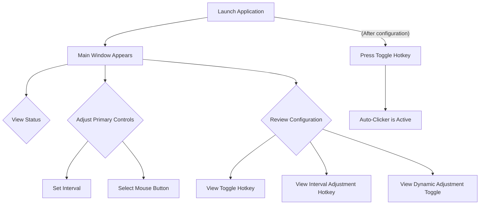
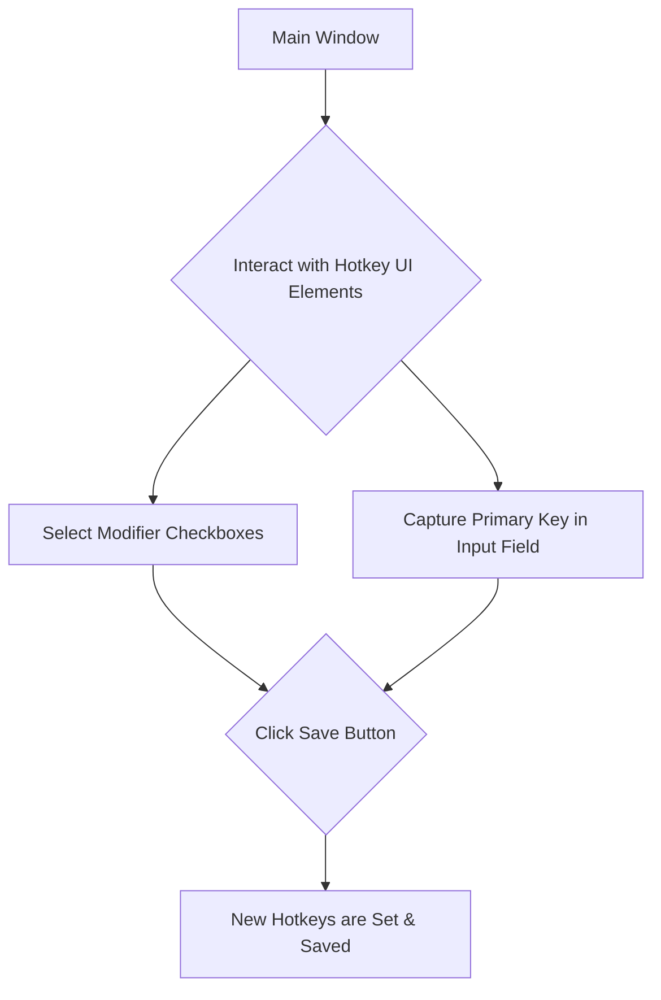

# SuperClicker UI/UX Specification

## Introduction

This document defines the user experience goals, information architecture, user flows, and visual design specifications for SuperClicker's user interface. It serves as the foundation for visual design and frontend development, ensuring a cohesive and user-centered experience.

The goal of this specification is to transform the current "ugly" and oversized window into a polished, professional, and compact utility that users will enjoy having on their desktop.

### Overall UX Goals & Principles

*   **Target User Personas:**
    *   **Gamer:** Needs quick access, low distraction, and high reliability.
    *   **Data Entry Clerk:** Needs clarity, simplicity, and ease of use.
*   **Usability Goals:**
    *   **Compactness:** The app should take up minimal screen real estate.
    *   **Clarity:** Status (Running/Stopped) should be instantly readable.
    *   **Efficiency:** Settings should be adjustable with minimal clicks.
*   **Design Principles:**
    1.  **Function over Form:** The UI should be invisible until needed.
    2.  **Compact by Default:** Default window size should be tight to the content.
    3.  **Visual Feedback:** Clear visual cues for active/inactive states.
    4.  **System Integration:** Look and feel should blend with Windows 11/10 aesthetics.
    5.  **Adaptive Theming:** Automatically respect system light/dark mode settings.

### Change Log

| Date       | Version | Description                             | Author |
| :--------- | :------ | :-------------------------------------- | :----- |
| 2025-11-27 | 1.0     | Initial Draft - UI/UX Refactor Proposal | Sally  |

## Information Architecture (IA)

The core problem you identified was the window being "too large" and lacking "margins." The initial wireframe within the PRD simply listed all elements vertically. With this new IA proposal, we aim to solve that by:

1.  **Prioritizing Core Information:** The most critical information is the current `Status` (Running/Stopped) and the `Primary Controls` (Interval, Mouse Button). These should always be visible and easily accessible.
2.  **Managing Complexity (Progressive Disclosure):** The hotkey customization (Toggle Hotkey Config, Interval Hotkey Config) and the `Dynamic Adjustment Toggle` are "set once" or "less frequently used" settings.

The current window is perceived as "too large" and lacks internal structure. The proposed Information Architecture (IA) focuses on addressing these issues through a clear hierarchy and visual grouping of elements.

Here's an expanded look at the rationale for the IA, specifically focusing on how it tackles the "too large" problem:

The current window is perceived as "too large" and lacks internal structure. The proposed Information Architecture (IA) focuses on addressing these issues through a clear hierarchy and visual grouping of elements.

**Core Problem:** The existing UI dumps all elements into a single, unorganized space, making it feel sprawling and inefficient. This directly conflicts with the desire for a "polished and professional" and "compact" utility.

**Proposed Solution - Element Grouping:**

1.  **Header Area:** This is a standard element that provides context (the application title) without consuming valuable central space. It’s part of the window’s chrome.

2.  **Status Area:** The "Running" or "Stopped" status is critical and needs to be highly visible at all times. Placing it prominently ensures immediate feedback, which is a core design principle. We might consider making this a larger font or color-coded to enhance visibility.

3.  **Primary Controls:** The "Interval Input" and "Mouse Button Selector" are settings that users will likely adjust more frequently than hotkeys. Keeping them easily accessible, perhaps grouped together, ensures quick configuration without deep navigation.

4.  **Configuration (Distinct Section):** The hotkey customization (Toggle Hotkey Config, Interval Hotkey Config) and the "Enable Dynamic Adjustment" checkbox are "set-and-forget" or less frequently accessed settings. These configuration settings will be grouped within a visually distinct container (e.g., a box with a border, a different background shade). This improves visual organization and keeps all settings visible.

## User Flows

The PRD already outlines several key user flows. I will augment these with details specific to the UI design, incorporating the new IA structure.

### Flow: Configuring and Running the Auto-Clicker

*   **User Goal:** To start the auto-clicker with the desired settings.
*   **Entry Points:** Launching the application.
*   **Success Criteria:** The user successfully starts the auto-clicker, and it performs clicks as configured.

*Flow Diagram (incorporating Distinct Visual Grouping):*

### Flow: Customizing Hotkeys

*   **User Goal:** To change the default hotkeys for toggling the auto-clicker and adjusting the interval.
*   **Entry Points:** Interacting with the hotkey customization section in the main window.
*   **Success Criteria:** The user successfully sets new hotkeys, and the application responds to the new hotkeys.

*Flow Diagram:*

## Wireframes & Mockups

The application will consist of a single, compact window. The key is to organize elements effectively within this constrained space.

### Screen: Main Window (Visual Blueprint: `reference_ui.jpg`)

*   **Purpose:** To provide a simple interface for configuring the auto-clicker and viewing its status.
*   **Layout Vision:** A vertically compact window, ideally fixed-size, with clear internal divisions for status, primary controls, and hotkey configuration. The goal is to maximize information density while maintaining readability and generous padding.

*   **Key Elements & Layout (Top-Down Flow):**

    1.  **Window Title Bar (System Default):** Will display "SuperClicker". The window will be non-resizable.

    2.  **Status Display:**
        *   **Placement:** Centered horizontally, prominently displayed in a dedicated area below the window title bar.
        *   **Design:** Displayed within a distinct button-like rectangular container with significantly rounded corners (similar to the primary action buttons).
        *   **Text:** Clear, bold text indicating "Status: RUNNING" or "Status: STOPPED". Font size should be slightly larger than standard body text for high visibility.
        *   **States & Colors (from `reference_ui.jpg`):**
            *   "Status: RUNNING": Green background (`#4CAF50` or similar vibrant green), white text.
            *   "Status: STOPPED": Light grey background with dark text in Light Mode; dark grey/subtle dark background with white text in Dark Mode.

    3.  **Primary Controls Group:**
        *   **Placement:** Below the Status Display, within its own distinct, slightly recessed or bordered container. The container should have rounded corners, subtly differentiating it from the main window background (e.g., a slightly darker shade in light mode, slightly lighter in dark mode).
        *   **Behavior:** This entire group will be **disabled** (greyed out and unresponsive to input) when the auto-clicker is "RUNNING". All interactive elements within should visually indicate their disabled state.
        *   **Elements:**
            *   **Click Interval (ms):**
                *   **Label:** "Click Interval (ms):" with a small icon (e.g., three horizontal lines or a gear) preceding it for visual emphasis.
                *   **Display:** When enabled, an editable text input field. When disabled (clicker running), it should display the current value as read-only text, e.g., "[100]".
                *   **Input Field:** Compact, rectangular field with rounded corners. Default value/placeholder "100". Accepts numeric input only.
            *   **Mouse Button:**
                *   **Label:** "Mouse Button:" with a small mouse icon preceding it.
                *   **Display:** When enabled, a dropdown selector. When disabled (clicker running), it should display the current selection as read-only text, e.g., "[Left]".
                *   **Dropdown:** Compact, rectangular selector with rounded corners. Default selection "Left". Options: Left, Middle, Right.
            *   **Dynamic Adjustment Toggle:**
                *   **Label:** "Enable Dynamic Interval Adjustment"
                *   **Checkbox:** Standard checkbox control. Checked state indicates enabled, unchecked indicates disabled.

    4.  **Manual Control Buttons:**
        *   **Placement:** Prominently displayed horizontally centered, below the "Primary Controls Group". The "Start" button should be on the left, and the "Stop" button on the right.
        *   **Elements & Styling (from `reference_ui.jpg`):**
            *   **Start Button:**
                *   **Appearance:** Large, rectangular button with significantly rounded corners.
                *   **Icon:** Features a distinct 'play' icon (triangle pointing right).
                *   **Label:** "Start" text alongside the icon.
                *   **States:** Enabled (blue background with white icon/text) only when the application is "STOPPED". Disabled (greyed out) when "RUNNING".
            *   **Stop Button:**
                *   **Appearance:** Large, rectangular button with significantly rounded corners, matching the 'Start' button's size.
                *   **Icon:** Features a distinct 'square' icon.
                *   **Label:** "Stop" text alongside the icon.
                *   **States:** Enabled (blue background with white icon/text) only when the application is "RUNNING". Disabled (greyed out) when "STOPPED".
        *   **Behavior:** These buttons provide an alternative to the hotkey for starting and stopping the auto-clicker. Their enabled/disabled states should be clear and visually responsive.

    5.  **Hotkey Configuration Group (Distinct Visual Grouping):**
        *   **Placement:** At the bottom of the window, clearly separated from the manual control buttons. Similar to the "Primary Controls Group," it should be within its own distinct, slightly recessed or bordered container with rounded corners.
        *   **Design:** The layout within this group should be compact, efficiently displaying all hotkey configuration elements.
        *   **Behavior:** This entire group will be **disabled** (greyed out and unresponsive to input) when the auto-clicker is "RUNNING". All interactive elements within should visually indicate their disabled state.
        *   **Elements for "Toggle Hotkey":**
            *   **Label:** "Toggle Hotkey:" with a small icon (e.g., keyboard key or toggle switch) preceding it.
            *   **Modifier Checkboxes:** Compact, horizontally aligned checkboxes for "Ctrl", "Alt", "Shift".
            *   **Primary Key Display:** A compact, read-only text input field displaying the currently assigned primary key for the hotkey, e.g., "[F6]". This field should capture a key press when active, rather than allowing free-form text input.
        *   **Elements for "Interval Adjustment Hotkey":**
            *   **Label:** "Interval Adjustment Hotkey:" with a small icon (e.g., scroll wheel or arrow) preceding it.
            *   **Modifier Checkboxes:** Compact, horizontally aligned checkboxes for "Ctrl", "Alt", "Shift".
            *   **Primary Key Display:** A compact, read-only text input field displaying the currently assigned primary key for the hotkey, e.g., "[Scroll]". This field should capture a scroll event or specific key press when active.
        *   **Save Behavior:** Changes are saved immediately upon valid input when the group is enabled (i.e., when stopped).

*   **Window Behavior:**
    *   **Fixed Size:** Non-resizable. The size will be determined by the content with appropriate padding.
    *   **Always On Top (Optional/Configurable):** Consider making this configurable if it aligns with user needs, but default to normal window behavior.
    *   **Close Behavior:** Closing the window minimizes to tray (if tray icon implemented) or fully exits the application.

## Component Library / Design System

Given the goal of a "simple, no-frills utility" and the use of the `iced` framework, we will rely on `iced`'s native widgets, applying minimal custom styling to achieve a polished, professional look consistent with Windows' aesthetic. We will not be developing a full custom design system.

### Design System Approach:

*   Utilize `iced`'s built-in widgets.
*   Apply custom styling primarily through `iced`'s `Theme` and `Style` APIs to align with desired visual aesthetic (e.g., compact spacing, appropriate colors for light/dark mode).
*   Prioritize clarity and readability over complex custom components.

### Core Components:

1.  **Text Label (`iced::widget::Text`):**
    *   **Purpose:** Display static text (e.g., "Status:", "Click Interval (ms):").
    *   **Variants:** Standard, Status (e.g., larger font for "RUNNING/STOPPED").
    *   **States:** None.
    *   **Usage Guidelines:** Concise and clear. Ensure sufficient contrast in both light and dark modes.

2.  **Text Input (`iced::widget::TextInput`):**
    *   **Purpose:** Allow users to enter numerical values (interval) or capture key presses (hotkey primary key).
    *   **Variants:** Numeric-only (for interval), Single-Key-Capture (for hotkeys).
    *   **States:** Default, Focused, Disabled, Error.
    *   **Usage Guidelines:** Compact height. Clear visual feedback on focus.

3.  **Dropdown Menu (`iced::widget::PickList` or equivalent):**
    *   **Purpose:** Select mouse button (Left, Middle, Right).
    *   **States:** Default, Open, Selected, Disabled.
    *   **Usage Guidelines:** Clear, concise options. Width should be just enough to display options.

4.  **Checkbox (`iced::widget::Checkbox`):**
    *   **Purpose:** Toggle binary options (e.g., "Enable Dynamic Interval Adjustment", modifier keys Ctrl/Alt/Shift).
    *   **States:** Checked, Unchecked, Disabled.
    *   **Usage Guidelines:** Clearly associated with its label.

5.  **Button (`iced::widget::Button`):**
    *   **Purpose:** Trigger actions (e.g., "Start", "Stop").
    *   **States:** Default, Hover, Pressed, Disabled.
    *   **Usage Guidelines:** Minimalist appearance. Clear affordance for clickability.

## Branding & Style Guide

Given the "simple, no-frills utility" vision and the goal to blend with the Windows aesthetic, our branding and style guide will be minimalist, focusing on leveraging system themes where possible and consistent application of spacing and typography.

### Visual Identity:

*   **Brand Guidelines:** Align with a clean, modern Windows application aesthetic. Avoid overly strong custom branding unless a simple icon is provided.

### Color Palette:

*   **Adaptive Theming (CRITICAL):** The application will primarily use system colors where available (e.g., main window background, default text color) to automatically respect the user's light or dark mode preference. This creates a seamless integration with the OS.
*   **Reference Aesthetic:** Inspired by a modern, clean UI with adaptive light/dark modes (as seen in `reference_color.jpg`) and incorporating elements of "Clean Card UI" / subtle layering (visible in `reference_ui.jpg`).
    *   **Containers/Cards:** Grouped elements (e.g., "Primary Controls", "Hotkey Configuration") should be in distinct "cards" with a background color slightly different from the main window background (e.g., slightly lighter in Dark Mode, slightly darker in Light Mode) to create a subtle sense of depth and separation.
    *   **Corners:** Generous border radius for a softer, modern feel on all interactive elements and grouping containers.
    *   **Contrast:** Text must remain high-contrast (WCAG AA compliant, 4.5:1 minimum) against all backgrounds.
*   **Accent Colors (from `reference_ui.jpg` and `reference_color.jpg` inspiration):**
    *   **Primary Interactive Blue:** `#0078D4` (Windows accent blue, observed on active buttons/focus states in `reference_ui.jpg`) for active states, primary buttons ("Start", "Stop" when active), and potentially focus indicators.
    *   **Status Green (Running):** `#4CAF50` (or a similar vibrant green as seen for "RUNNING" status in `reference_ui.jpg`).
    *   **Status Grey (Stopped):** `#A0A0A0` (light grey for "STOPPED" status background in `reference_ui.jpg` Light Mode). In Dark Mode, a darker desaturated grey should be used.
*   **General UI Element Colors:**
    *   **Text/Icons (Light Mode):** Predominantly dark grey/black.
    *   **Text/Icons (Dark Mode):** Predominantly white/light grey.
    *   **Input Field Background:** White in Light Mode, very dark grey in Dark Mode.
    *   **Disabled State Overlay:** A semi-transparent grey overlay or desaturation effect to visually indicate disabled elements.

### Typography:

*   **Font Families:** Utilize the system default UI font (e.g., Segoe UI on Windows) to maintain a native feel.
    *   **Rationale:** Using the system's default UI font (like Segoe UI on Windows 10/11) is a key part of the "System Integration" design principle. It ensures that the application's text rendering feels native and familiar to the user, seamlessly blending with other applications on their operating system. This approach avoids the need to bundle custom fonts, reducing application size and ensuring optimal performance, especially for a lightweight utility.
*   **Type Scale:** Keep it simple.
    *   **H1 (App Title):** (System Default, e.g., large Segoe UI)
    *   **Body:** (System Default, standard size)
    *   **Small:** (System Default, slightly smaller for labels or secondary info)

### Iconography:

*   **Icon Library:** Use simple, crisp, monochromatic icons where necessary (e.g., expand/collapse arrow if implemented, possibly a small tray icon). Leverage system-provided icons if possible.

### Spacing & Layout:

*   **Grid System:** Implicit. Layout will be largely linear (vertical stack) with consistent padding.
*   **Spacing Scale:** Establish a consistent, small scale for internal padding and margins (e.g., 4px, 8px, 12px, 16px multiples). The goal is generous but not excessive padding, contributing to the "polished" feel.
    *   **Internal Padding:** Sufficient space around elements within groups.
    *   **Group Separation:** Slightly larger vertical margins between distinct control groups.

## Accessibility Requirements

Ensuring the application is accessible is crucial for a professional and inclusive user experience. We will aim for a reasonable level of compliance given the utility's scope.

### Compliance Target:

*   **Standard:** WCAG AA (Web Content Accessibility Guidelines 2.1 Level AA) as a guiding principle, adapted for a desktop application context.

### Key Requirements:

*   **Visual:**
    *   **Color contrast ratios:** Ensure a minimum contrast ratio of 4.5:1 for normal text and 3:1 for large text and graphical components (including UI states like disabled elements). This will be validated for both light and dark modes.
    *   **Focus indicators:** All interactive elements must have a clear and visible focus indicator (e.g., a blue ring around the focused element) when navigating via keyboard.
    *   **Text sizing:** Text should be scalable (within system limits) and clear.

*   **Interaction:**
    *   **Keyboard navigation:** All interactive UI elements must be navigable via keyboard (Tab, Shift+Tab for reverse, Enter/Space for activation). Logical tab order is essential.
    *   **Screen reader support:** Labels for all interactive elements and status indicators must be programmatically determinable and convey purpose to screen readers.
    *   **Touch targets:** While primarily a desktop app, ensure sufficient spacing for any click targets.

*   **Content:**
    *   **Labels:** All input fields, buttons, and checkboxes must have clear, associated labels.
    *   **Status messages:** Ensure status changes (e.g., "RUNNING" to "STOPPED") are conveyed to assistive technologies.

### Testing Strategy:

*   **Manual Testing:** Regular manual checks using keyboard navigation and visual inspection.
*   **Automated Tools:** (If `iced` supports it) Integrate accessibility linters or checkers into the development workflow.
*   **Assistive Technologies:** (If feasible) Basic testing with a screen reader (e.g., NVDA or Narrator on Windows).

## Responsiveness Strategy

For a desktop application with a fixed-size window, the concept of "responsiveness" differs from web development. Instead of adapting to various screen sizes, it focuses on ensuring the UI remains usable across different display settings (e.g., DPI scaling, multi-monitor setups) and provides a consistent experience.

### Breakpoints:

*   **Fixed Window Size:** The primary strategy is a fixed window size, eliminating the need for traditional breakpoints. The window dimensions will be determined by the content with appropriate padding and margins.

### Adaptation Patterns:

*   **Layout Changes:** None, due to fixed window size.
*   **Navigation Changes:** None.
*   **Content Priority:** All content will be visible within the fixed window.
*   **Interaction Changes:**
    *   **High DPI Scaling:** The application will respect operating system-level DPI (Dots Per Inch) scaling settings. All UI elements (fonts, widgets, spacing) should scale proportionally to ensure legibility and correct sizing on high-resolution displays.
    *   **Font Scaling:** Fonts will scale with the overall UI scaling factor set by the OS.

## Animation & Micro-interactions

Given the "simple, no-frills utility" vision, animations and micro-interactions will be minimal and purposeful, primarily serving to provide clear feedback and enhance usability without being distracting.

### Motion Principles:

*   **Subtle & Functional:** Animations should be subtle and directly tied to providing feedback or guiding the user.
*   **Fast & Responsive:** Interactions should feel immediate. Animations should be brief to avoid perceived latency.
*   **Consistent:** Similar interactions should have consistent animation patterns.

### Key Animations:

*   **Status Change:**
    *   **Animation:** A subtle, quick fade or color transition when the "Status" display changes from "STOPPED" to "RUNNING" and vice-versa.
    *   **Purpose:** Reinforce the change in application state.
*   **Disabled State:**
    *   **Animation:** A smooth transition (e.g., opacity, color desaturation) when interactive elements become disabled/enabled based on the auto-clicker's running state.
    *   **Purpose:** Clearly communicate the interactive state of controls.
*   **Hotkey Input Capture (Implicit):**
    *   **Animation:** When a user is setting a hotkey, a brief visual cue (e.g., a subtle highlight or color change) on the input field when a key is successfully captured.
    *   **Purpose:** Provide immediate feedback that the key press was recognized.

## Performance Considerations

For a lightweight auto-clicker, performance is paramount. The UI itself should have minimal impact on system resources, allowing the core clicking functionality to operate efficiently in the background.

### Performance Goals:

*   **UI Render Time:** UI updates should be instantaneous, with no perceptible lag during interactions or status changes.
*   **CPU Usage (UI):** The UI component should consume negligible CPU cycles when idle (i.e., when no user interaction or state change is occurring).
*   **Memory Footprint (UI):** The UI's memory usage should be minimal, consistent with a small native desktop application.

### Design Strategies:

*   **Efficient Rendering:** Leverage `iced`'s efficient rendering capabilities. Avoid unnecessary re-renders.
*   **Minimalist Design:** The simple, clean design with few complex components inherently reduces rendering overhead.
*   **Passive Interaction:** The UI is primarily for configuration and status. Active interaction (e.g., animations) is minimal.
*   **Optimized Hotkey Polling (Developer Task):** Although primarily a development concern, ensuring the hotkey detection mechanism is efficient (as addressed in a tech debt story) directly impacts overall application performance and resource consumption, which is a key UX goal.

## Next Steps

After completing the UI/UX specification, the following actions are recommended:

### Immediate Actions:

1.  **Stakeholder Review:** Review this complete UI/UX Specification with relevant stakeholders (Product Owner, Project Manager, Developer) to ensure alignment and gather feedback.
2.  **Visual Design Prototype:** Based on this specification, create a low-fidelity visual design prototype (e.g., using a design tool like Figma or directly in code via `iced` if that's more efficient) for key screen layouts, specifically the Main Window. This will help visualize the proposed compact layout and aesthetic.
3.  **Handoff to Developer:** This specification serves as a detailed guide for the development team to implement the UI/UX improvements.

### Design Handoff Checklist:

*   All user flows documented
*   Component inventory complete
*   Accessibility requirements defined
*   Responsive strategy clear
*   Brand guidelines incorporated
*   Performance goals established